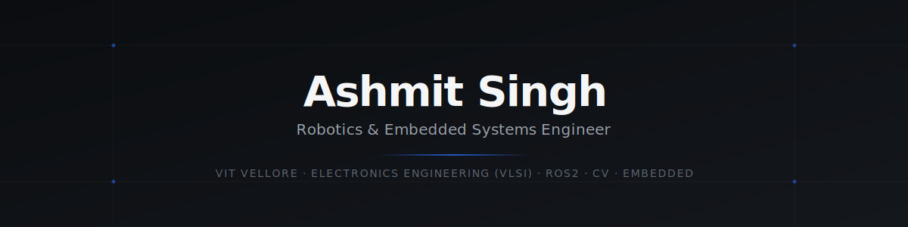

<div align="center">



<sub>Building robots, embedded systems, and other things that probably should've worked the first time.</sub>

<br/><br/>

[](https://linkedin.com/in/ashmitsingh7)
[](mailto:ashmitsingh719@gmail.com)

</div>

<br/>

## About

I'm an electronics engineering undergrad at VIT Vellore, spending most of my time on **robotics, embedded systems, and computer vision** — not because I've mastered them, but because they keep surprising me with how much there is left to learn.

I care about building **complete systems**, not just isolated scripts. That usually means moving across the whole stack on a project: sensor selection and signal integrity, firmware and real-time control, perception algorithms, and the software layer that ties it all together for a human to actually use. On the hardware side, I'm going deeper into **VLSI and digital design** — RTL, FPGA implementation, and increasingly RISC-V — which is closer to what my degree is actually in, even if most of my project time still goes to robotics.

<br/>

## Currently Building

<table>
<tr><td>

### Industrial Dimensioning, Weighing & Scanning System (DWS)
**Internship — Delhivery Limited** · May – Jul 2026 · <sub>repository private — company confidentiality</sub>

An 8-node ROS2 perception system built for a live warehouse induction line, replacing manual volumetric measurement and sustaining roughly one parcel every six seconds. The brief was simple to state and hard to build: scan a parcel, capture its depth image, measure its dimensions, read the barcode, log the weight — all without an operator touching it.

<details>
<summary><b>Technical implementation</b></summary>
<br/>

- Integrated a multi-sensor capture stack — an Essae digital weighing scale over serial, a USB barcode scanner, and a vision path that moved from an initial Cognex camera to an Intel RealSense D455 depth sensor — into one synchronized pipeline
- Built a 12-stage classical computer vision pipeline on the depth stream: RANSAC-based floor-plane segmentation followed by PCA-based oriented bounding-box fitting to recover parcel dimensions
- Designed an orchestrator finite-state machine that gates the vision pipeline on scale-stability, eliminating false triggers from operator hands or trolleys crossing the sensor's field of view
- Built a local-first data layer on SQLite (write-ahead logging) behind a FastAPI backend, with a live WebSocket dashboard for floor operators
- Prototyped an AI-assisted segmentation approach for separating parcels from a cluttered conveyor surface — it handled messy point clouds better than the classical method alone, but the added inference latency didn't fit the pipeline's timing budget, so production runs a geometry-first hybrid with the learned model as a fallback path rather than the primary one

</details>

**Skills demonstrated** — end-to-end systems architecture · ROS2 node design · classical CV (RANSAC, PCA, OBB) · finite-state machine design · REST/WebSocket backend · embedded data reliability · production debugging under latency constraints

     

</td></tr>
</table>

<br/>

## Projects

<table>
<tr><td>

### 1 · [Team Vyadh — Mars Rover Manipulator](https://github.com/ashmitsingh7/Team-Vyadh-Robotic-Arm)

As a senior core member of the robotic-arm domain on VIT's Martian rover team, I worked on the 5-DOF manipulator built for the International Rover Challenge — rated for roughly 1000–1500 kgf·cm of joint torque under planetary terrain-sampling loads, where every gram and every volt matters because the whole arm has to survive a rover chassis moving over rough ground.

<details>
<summary><b>Technical implementation</b></summary>
<br/>

- Designed a cascaded power distribution system — 12V for actuators, 6V for logic — with isolated grounding between the two domains to keep noisy motor currents from corrupting sensor and control signals under dynamic loading
- Fabricated precision 3D-printed mounts for AS5600 magnetic joint encoders, which needed to hold tight alignment under vibration to keep feedback accurate
- Tuned closed-loop PID control on the encoder feedback to get joint positioning accuracy under 1°
- Spent the most time on the differential wrist mechanism, where mechanical coupling between two joints made naive control tuning fail — getting it stable took several competition-cycle iterations

</details>

**Skills demonstrated** — power system design · closed-loop PID control · encoder-based feedback (AS5600) · mechanical-electrical integration · debugging under competition time pressure

   

🏆 **17th place overall — International Rover Challenge (IRC) 2026**

</td></tr>
<tr><td>

### 2 · [Gesture-Controlled Robotic Arm](https://github.com/ashmitsingh7/robotic-arm-vision-control)

A personal project built to understand a full perception-to-actuation chain end to end, not just one layer of it. A laptop webcam feeds MediaPipe's hand-pose model, which gets translated into discrete gesture classes, sent as a joint command over a lightweight TCP protocol, and executed on an ESP32/Arduino Nano pipeline driving the physical servos.

<details>
<summary><b>Technical implementation</b></summary>
<br/>

- Built real-time hand-pose estimation and gesture classification on top of MediaPipe, running on live webcam input rather than pre-recorded frames
- Designed a lightweight TCP messaging protocol to carry joint commands from the host PC to the embedded controller with minimal framing overhead
- Mapped classified gestures to coordinated multi-joint servo actuation on the ESP32/Arduino Nano side
- The core engineering problem wasn't any single stage — it was the cumulative latency budget across capture, inference, network transport, and actuation

```
Camera → MediaPipe → Gesture Classification → TCP → ESP32 → Servo Control
```

</details>

**Skills demonstrated** — real-time computer vision · low-latency network protocol design · embedded actuation and servo control · end-to-end latency budgeting

    

</td></tr>
<tr><td>

### 3 · [PID Hardware Accelerator](https://github.com/ashmitsingh7/PID_Hardware_Accelerator)

A deliberate bridge project between the control-systems work from robotics and the VLSI side of my degree — the question being whether a PID controller implemented directly in hardware can genuinely outperform the same control loop running in software.

<details>
<summary><b>Technical implementation</b></summary>
<br/>

- Implementing the controller as synthesizable RTL in Verilog rather than a behavioral model, with fixed-point arithmetic replacing floating-point to keep the datapath hardware-realistic
- Structuring the design as a pipelined datapath to keep throughput high without serializing every multiply-accumulate step
- Working through timing closure in ModelSim, where simulated timing doesn't always match intuition built from software control-loop design — this part is still in progress, since FPGA implementations tend to surface edge cases that don't show up until you're looking at actual waveforms

</details>

**Skills demonstrated** — RTL design (Verilog/SystemVerilog) · fixed-point arithmetic · pipelined digital datapath design · timing analysis and simulation · Quartus synthesis flow

   

<sub>Status: work in progress</sub>

</td></tr>
<tr><td>

### 4 · [RISC-V ReRAM In-Memory Computing SoC](https://github.com/ashmitsingh7/RISCV-ReRAM-IMC-SOC)

The most direct expression of the VLSI Design and Technology side of my degree — an exploration of in-memory computing built around ReRAM alongside a RISC-V core, feeding the same underlying interest in how compute actually happens at the hardware level rather than treating the chip as a black box beneath the software.

**Skills demonstrated** — RISC-V core-level architecture · in-memory computing concepts · ReRAM-based memory/compute design · RTL implementation

   

<sub>Status: early stage</sub>

</td></tr>
</table>

<br/>

## Tech Stack

<table>
<tr>
<td valign="top" width="20%"><b>Languages</b></td>
<td valign="top">
      
</td>
</tr>
<tr>
<td valign="top"><b>Robotics</b></td>
<td valign="top">
   
</td>
</tr>
<tr>
<td valign="top"><b>Computer Vision</b></td>
<td valign="top">
    
</td>
</tr>
<tr>
<td valign="top"><b>Control Systems</b></td>
<td valign="top">
  
</td>
</tr>
<tr>
<td valign="top"><b>Embedded</b></td>
<td valign="top">
      
</td>
</tr>
<tr>
<td valign="top"><b>Digital Hardware</b></td>
<td valign="top">
    
</td>
</tr>
<tr>
<td valign="top"><b>Tools</b></td>
<td valign="top">
      
</td>
</tr>
</table>

<br/>

## Where I've Been · Where I'm Going

```
2024   ✓  Embedded robotics
       ✓  Competition robotics (Team Vyadh)
       ✓  Control systems

2025   ✓  Computer vision
       ✓  ROS2
       ✓  Industrial automation (DWS internship)

2026   ●  FPGA accelerators
       ●  RISC-V / VLSI exploration
       ●  Deeper into ROS2 ecosystem

Soon   ○  SLAM
       ○  Robot navigation
       ○  Autonomous manipulation
```

<br/>

<div align="center">
<sub><code>ashmitsingh7</code> · open to interesting problems · learning in public</sub>
</div>
