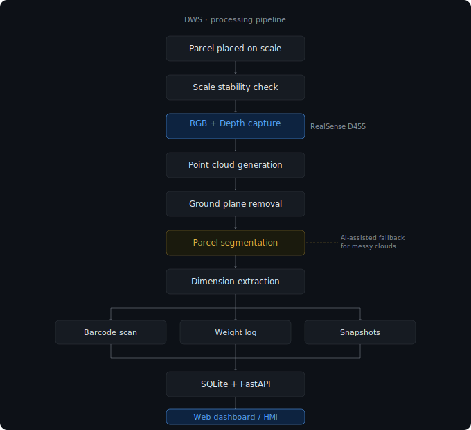

<div align="center">


<br/>

[](https://linkedin.com/in/ashmitsingh7)
[](mailto:ashmitsingh719@gmail.com)

</div>

---

## About

I'm an electronics engineering undergrad at VIT Vellore. Most of my time goes into **robotics, embedded systems and computer vision** — not because I've mastered them, but because they keep surprising me with how much there is left to learn.

I care about building **complete systems**, not just isolated scripts. Sensors, firmware, control, perception, software — I want to understand how each layer connects to the next. I'm somewhere in the middle of that journey.

---

## Currently Building

> 🟢 **ACTIVE · Internship @ Delhivery**

### Industrial Dimensioning, Weighing & Scanning System (DWS)

`repository private — company confidentiality`

A production warehouse perception pipeline for automatic parcel processing. The goal: scan a parcel, capture its depth image, measure dimensions, read the barcode, log the weight — all without human input. Harder in practice than it sounds on paper.



> At one point I tried using an AI-assisted segmentation approach to separate the parcel from the conveyor surface. It helped with messy point clouds but added latency — so I ended up using a hybrid: geometry-first with a learned fallback. Not elegant, but it works in production.

`ROS2` `RealSense D455` `Point Clouds` `FastAPI` `SQLite` `WebSocket HMI` `Python`

---

## Projects

### Team Vyadh — Mars Rover Manipulator

`C++` `Embedded` `Competition`

5-DOF robotic arm built for the International Rover Challenge. I worked on embedded control — ESP32 firmware, encoder feedback loops, the differential wrist mechanism that took the most time to get stable. Learned more from what broke during competition than from what worked.

`ESP32` `Encoder feedback` `Differential wrist` `C++`

→ [github.com/ashmitsingh7/Team-Vyadh-Robotic-Arm](https://github.com/ashmitsingh7/Team-Vyadh-Robotic-Arm)

---

### Gesture Controlled Robotic Arm

`Python` `CV` `Embedded`

Camera input → MediaPipe hand pose → gesture recognition → TCP → ESP32 → servos. Built this to understand the full perception-to-actuation chain. The latency budget was the interesting part — every layer adds delay and it adds up.

```
Camera → MediaPipe → Gesture classification → TCP → ESP32 → Servo control
```

`OpenCV` `MediaPipe` `ESP32` `TCP/IP`

→ [github.com/ashmitsingh7/robotic-arm-vision-control](https://github.com/ashmitsingh7/robotic-arm-vision-control)

---

### PID Hardware Accelerator

`Verilog` `FPGA` `RTL`

Can you implement a PID controller in hardware and make it genuinely faster than software? Exploring that question in Verilog. Current focus: fixed-point arithmetic, pipeline stages, and getting ModelSim to stop lying to me about timing.

*Still a work in progress — FPGA implementations tend to surface edge cases you didn't think of.*

`Verilog` `SystemVerilog` `Quartus` `ModelSim` `RTL`

→ [github.com/ashmitsingh7/PID_Hardware_Accelerator](https://github.com/ashmitsingh7/PID_Hardware_Accelerator)

---

## Engineering Domains

| Robotics | Embedded | Vision | Digital HW |
|---|---|---|---|
| ROS2 | ESP32 | OpenCV | Verilog |
| Kinematics | STM32 | RealSense | FPGA design |
| Manipulators | UART / SPI / I²C | Point clouds | RTL |
| Motion control | Encoder feedback | MediaPipe | Quartus |

---

## Where I've Been · Where I'm Going

```text
2025
✓ Embedded Robotics
✓ Competition Robotics (Team Vyadh)
✓ Control Systems

2026
✓ Computer Vision
✓ ROS 2
✓ Industrial Automation (Delhivery DWS)
✓ FPGA Accelerators
✓ RISC-V Exploration

Next
○ Exploring Robotics Research
○ VLSI & Hardware Acceleration
○ Smart Materials & Actuators
```

---

## How I Think About Building

```
01  Build systems, not features.
    The interesting problems live at the interfaces between layers.

02  Hardware failure teaches you things software testing never will.

03  Understand it before you automate it.

04  Documentation is part of the build, not an afterthought.

05  There's a lot I don't know yet. That's the point.
```

---

<div align="center">

`ashmitsingh7` · open to interesting problems · learning in public

</div>
